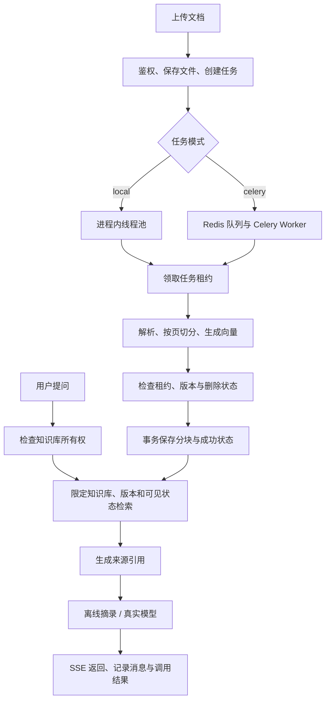
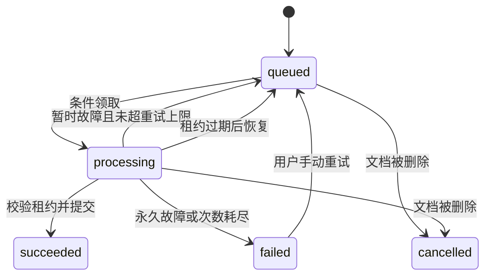

# 架构与关键设计

## 1. 两条业务链路



API 不等待 PDF 解析完成才响应上传请求。耗时处理发生在独立的执行路径；生产配置使用独立 Worker 进程。`async def` 不会让 CPU 解析自动并行，不能把同步 PDF 解析直接塞进事件循环。

## 2. 表结构及一致性

| 表 | 作用 | 关键约束 |
|---|---|---|
| users | 用户与密码哈希 | 邮箱唯一 |
| knowledge_bases | 知识库所有者与软删除标记 | owner_id 外键 |
| documents | 文件元数据、内容指纹、版本、状态 | 同一知识库的 SHA-256 唯一 |
| document_chunks | 正文、页码、向量 | document_id + version + chunk_index 唯一 |
| ingestion_jobs | 处理状态、尝试次数、租约 | 一个文档一条当前任务记录 |
| conversations | 会话归属 | 知识库和用户外键 |
| messages | 问答内容、引用、完成状态 | 会话外键 |
| llm_calls | 模型、耗时、状态、用量 | 用户和会话外键 |

同样的字节重复上传到同一知识库会返回既有文档与任务；文件名不同不改变内容身份。若该文档已经软删除，再上传时版本递增并重新入库。当前设计没有保存所有历史文件版本的下载副本，不是完整文档版本管理系统。

Alembic 迁移显式声明表结构；API 本地模式的 `create_all` 仅用于新库初始化，不会自动修改旧表。生产模式必须通过迁移升级。

SQLite 不实现 PostgreSQL 的 `SELECT ... FOR UPDATE` 行锁语义。本地模式由 `db.begin_write` / `write_session` 在写事务第一次查询前执行 `BEGIN IMMEDIATE`，先取得写锁再读取并修改状态；普通读取使用 `BEGIN`，文件数据库启用 WAL。这样会串行化数据库写入，适合本地小规模演示，不能据此承诺高并发写入能力。PostgreSQL 则在关键资源处使用行锁和事务校验。并发回归测试覆盖了“清理已删除文档的同时再次上传相同内容”：恢复上传等待清理事务结束，再发布新版本，防止旧清理覆盖新文件状态。

## 3. 租约与任务恢复

Worker 使用带条件的 UPDATE 领取任务，同时生成随机 `lease_token`。处理开始后，解析和向量请求不长时间占用数据库事务。最终写入时重新检查：

1. 当前任务是否仍处于 processing，且租约 token 与本 Worker 一致。
2. 文档是否仍然存在且未删除。
3. 文档版本是否仍与处理开始时一致。

满足条件后，删除旧分块、写入新分块、设置文档 ready 和任务 succeeded，在同一事务提交。超时的旧 Worker 即使稍后返回，也不能覆盖新 Worker 的输出。

任务状态流转：



Celery 使用延迟确认和有限重试。Beat 每分钟扫描可恢复任务；本地 API 启动时扫描一次，也可以通过 `python -m app.manage recover-jobs` 手动恢复。本地模式没有周期恢复扫描，如果启动时旧租约尚未到期，需到期后执行该命令或重启 API。数据库中的任务记录是恢复依据，但这个实现不是通用事务 Outbox，也不提供 exactly-once 语义。租约没有周期续租，长文档处理时间应小于 `JOB_LEASE_SECONDS`；否则可能有重复计算，租约校验仍用于防止旧结果覆盖。

## 4. 权限与删除

请求必须先验证 JWT 和资源所有者。对于不存在或不属于用户的资源，统一返回 404，减少资源枚举。查询任务、下载原文件、查询会话也应遵守相同原则。

检索 SQL 按知识库限定，并筛选文档 ready、未删除、当前版本、相同向量配置指纹。知识库软删除后，不再允许访问它的文档、任务或会话。删除不依赖磁盘清理是否成功；文件/分块清理可以幂等重试。

历史消息保存引用快照，删除文档不重写已有会话内容。此设计用于个人项目的可追溯性，不能宣称“完全抹除所有历史数据”。

## 5. RAG 和向量配置

PDF 按页抽取文字；分块优先在附近的换行或句子边界结束，并保留重叠。TXT/MD 没有真实分页，来源页码统一为 1。参数 `CHUNK_SIZE` 按字符计，不是 Token 数。

离线 hash 特征包含英文词和中文单字/双字特征，经过稳定哈希和归一化。它能验证索引、隔离和引用管线，但不能提供语义模型的同义改写能力。向量相似度不是答案正确的概率。

PostgreSQL 使用 pgvector 的余弦距离排序和 LIMIT 实现**精确搜索**，没有创建近似搜索索引。SQLite 遍历当前知识库候选向量，使用有界堆保留 Top-K，适用于小规模调试。未来加 HNSW 前应先测量候选规模和 SQL 执行计划，并验证权限过滤与近似召回的交互。

每个文档记录 `embedding_fingerprint`，包含提供方、端点、模型和维度配置。检索只使用匹配的向量，避免错误比较两个模型的空间。切换模型后重新建知识库入库最容易复现；旧文档不会自动转换。

## 6. SSE 与模型调用

`POST /api/v1/knowledge-bases/{id}/chat` 的成功响应类型是 `text/event-stream`：

```text
event: meta
data: {"conversation_id":"...","provider":"demo","model":"..."}

event: sources
data: {"citations":[...]}

event: token
data: {"content":"一段内容"}

event: done
data: {"message_id":"...","status":"completed","usage":{...}}
```

失败会发送 `error` 事件，具体字段以 OpenAPI、代码和回归测试为准。HTTP 头发出后不能再把状态码改成 500，客户端必须同时判断 SSE 中的 error 和 done 状态，不能仅凭 HTTP 200 判成功。聊天使用 POST，浏览器原生 `EventSource` 仅支持 GET；制作前端时应使用 `fetch` + `ReadableStream` 或支持 POST 的 SSE 客户端。

模型适配处理总时限、429、认证失败、流中断、无效协议和不完整回答。已开始的生成请求不自动重试，也不拼接另一个模型的回答。客户端断开会关闭生成流，但上游已经消耗的 Token 不一定能够撤销计费。

资料以不可信上下文传入模型，要求按来源编号回答；后端权限过滤才是数据隔离边界，提示词不能替代权限检查。空检索会直接返回资料不足，不调用上游；有检索结果仍可能答错，需要人工评测证据支持程度。当前不会校验每个自然语言结论都被引用支持。

## 7. 观测和运行边界

调用记录保存 provider/model、总耗时、首个内容片段耗时、状态、错误码和 Token 用量。上游不返回 Token 时保存 null，离线模式也不会伪造用量。并发限制按 API 进程计算，Redis 限流用于跨进程请求频率控制，两者不是同一件事。

`GET /api/v1/usage` 的 `calls` 是已保存的生成请求记录数，包含 demo 摘录和没有检索结果时的本地拒答，不代表模型供应商已接收或已计费的请求数。`successful_calls` 对应状态 `completed`，`failed_calls` 为其余记录数，包含失败与客户端取消。Token 聚合只累加各字段的已知值；`usage_unavailable_calls` 表示至少一个 Token 字段未知的记录数。因此聚合值为 0 也不能说明真实消耗为 0，未知用量不能用于估算完整账单。

当前会话 ID 用于保存记录；每次提问独立检索与生成，历史消息不会进入下一次模型提示，因此不支持多轮指代消解。应用日志不应输出密钥、上游原始错误正文或整段私有文档。生产部署还需要 HTTPS、备份恢复、数据保留策略、告警和容量验证，这些不由 Compose 文件自动完成。
